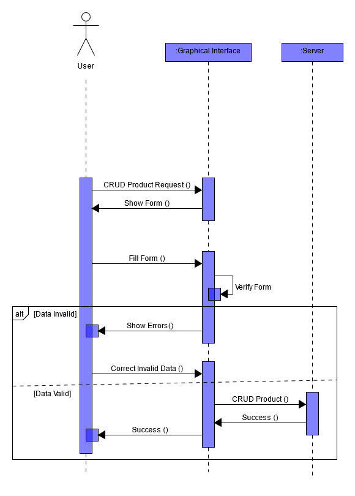

# Inventory Management Application

Conception and Development of an Application to manage the inventory of a store.

## Conception

UML Diagrams :

- Use Case Diagram :

- Class Diagram :

- Sequence Diagram :

## Mockups & Prototyping

You can preview the Figma file [HERE](https://www.figma.com/proto/6JTwgooyVt0zsoVSGKk3Ak/Brief-4?node-id=11%3A10&scaling=contain&page-id=0%3A1&starting-point-node-id=11%3A10)
